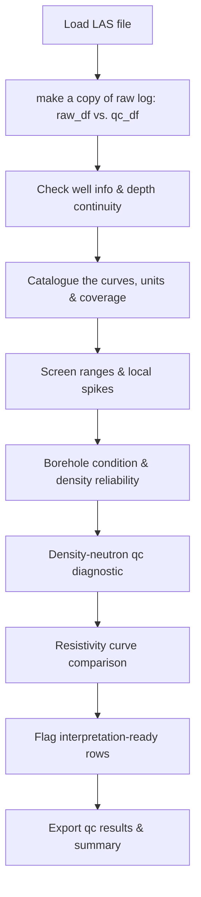

# Volve Well-Log QC and Formation Evaluation

## What this is
A Python workflow that checks whether well-log measurements from a real North Sea well can be trusted, before any rock or fluid property is calculated.
Built on Equinor's open Volve dataset, well 15/9-F-1.
Petrophysics has a simple rule that should be followed before every composite file and interpretation. Before you calculate porosity or water saturation, you must know whether the measurement you're using is reliable. 
Factors like: - washed-out borehole, - poor density correction, - mud additive contaminating a reading: will quietly feed wrong numbers into a correct formula. 

This notebook performs that check properly and shows its work at every stage.

## Headline

- 10,007 of 34,861 log readings passed full QC and are flagged interpretation-ready (2,605-3,606.7 m having the needed logs and qc).
- Every threshold is grounded in petrophysics literature or stated reasoning, not some arbitrary cutoffs.
- Built with AI-assisted coding; reviewed and corrected the generated code myself, including catching a duplicated function and two dead variables.

## Why 
During my MSc thesis (reservoir characterization of the Nise Formation, NTNU), I relied heavily on the petrophysical interpretation (IP) of the 4 wells.
There was very little study of the Nise Formation on the Eastern Norwegian Continental Shelf (NCS), especially in the Halten Terrace area. With little published work on the Nise Formation in this area to use as an established reference, I had to cross-validate my interpretation across the 4 wells. This meant getting it exactly right and required extensive QC on the 1982 to 1996 vintage wells in IP.

This was a manual task that took a long time to complete, with lots of note-taking and some visual strain. The log QC was something I did by hand: scroll through each curve, compare caliper against bit size by eye, check density correction curves one depth at a time, and flag anything that looked wrong. It works, but it is slow, and it is easy to miss a flag buried among tens of thousands of depth points in a long well.
This notebook automates the same checking process across an entire well in seconds instead of hours and keeps every flag attached to the data without deleting anything. This approach ensures that the reasoning remains visible and checkable afterward by the petrophysicist

## What gets flagged, and why
Every check and threshold in this notebook is chosen for a physical reason, not arbitrarily. The main ones:

**Borehole condition (CALI vs. BS).**
The caliper log measures the actual hole diameter; BS is the size the drill bit was supposed to cut. When they match closely, the hole is in good condition, and tools sitting against the borehole wall (density, PEF) are getting good contact.
This notebook treats the hole as on-gauge within 0.5 inches, a standard practical tolerance for borehole quality screening. Beyond that, a wider hole suggests washout or caving, while a moderately narrower one suggests mudcake buildup or a tight, swelling formation.
But a CALI reading more than 2 inches below BS is not considered mudcake. Mudcake builds up gradually; it doesn't cause a sudden jump of several inches. A gap that large is flagged separately as a likely section boundary, casing point, or bit-size change, rather than a borehole-quality issue. 
In this well, checking that flag directly caught a cluster of rows near the top of the logged interval, which turned out to be a section transition where density logging hadn't started yet, not a tight hole.

**Density correction (DRHO).**
The density tool corrects for poor borehole contact, and the magnitude of that correction indicates how much to trust the reading. Asquith (Asquith & Gibson, 1982) treats DRHO above 0.20 g/cm3 as the threshold for an unreliable reading.
This notebook sets a stricter caution threshold at 0.10 g/cm3, with 0.15 g/cm3 indicating strong concern. The stricter threshold was chosen deliberately because no core or mud report is available for this well to confirm hole condition. Therefore, the safer assumption is to flag earlier rather than later.

**Photoelectric factor (PEF).**
PEF identifies rock type almost independently of porosity, making it useful for lithology. But it is just as sensitive to borehole contact as density. 
PEF has one more weakness: barite, a common heavy mud additive, has a photoelectric factor of roughly 267, compared with about 1.8 for quartz, 5 for calcite, and 3 for dolomite. 
Even a small amount in the mudcake changes the rock signal. Naturally occurring heavy minerals like pyrite or siderite can push PEF higher too.
The mud system used in this well is not documented in the file. To avoid guessing, this notebook flags any PEF reading above 10 b/e, a level no common clean reservoir lithology reaches on its own. This flag exists specifically to compensate for not knowing the mud type, not to diagnose the cause.

**Resistivity curve duplication.**
The file contains 7 resistivity-labeled logs. Several are repeated or nearly identical outputs from the same induction tool measured at different borehole distances. 
Logs RPCEHM and RT, for example, correlate at 1.000, an exact match.
Not all 7 are independent measurements. The notebook checks every pair against each other to prevent the same signal from being mistaken for 6 separate pieces of evidence.

## How (Workflow)

            A Simple Workflow 

I supervised the petrophysics and clarified what mattered, what each measured threshold should be and why, and what a passing or failing qc flag should mean, as outlined in the section above. 

Claude (Anthropic) wrote the Python code implementing that logic, which was faster than building and debugging it manually.

Every result was checked against the actual well data. This flagged functions such as “make_nullable_boolean_flag” that were defined twice in separate cells, as well as two variables from earlier revisions that were no longer used anywhere. 
These errors were corrected, and the notebook was re-run each time to confirm that the qc conclusions remained unchanged.
The energy industry has become increasingly open to embedding AI directly into subsurface workflows, for example, among companies on the Norwegian Continental Shelf (NCS). 
This project reflects the same line: AI accelerates implementation, while the petrophysical judgment behind it remains human and accountable.

## Results

10,007 of 34,861 depth rows passed full QC and are marked interpretation-ready. The 10,007 rows span 2,605 to 3,606.7 metres. 
Every other row carries its original data; nothing was deleted, only flagged for visualization.

## Data

Equinor's Volve field dataset, released under CC BY-NC-SA 4.0.

## How to run

Requires Python with `lasio`, `pandas`, `numpy`, and `matplotlib`. Open 
the notebook and run all cells from top to bottom.
