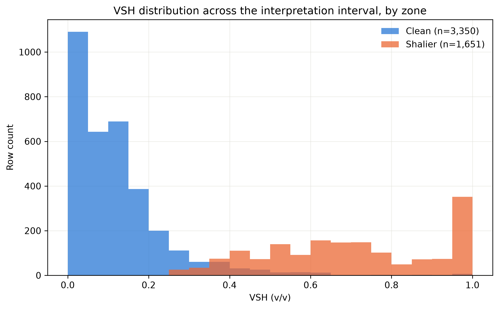
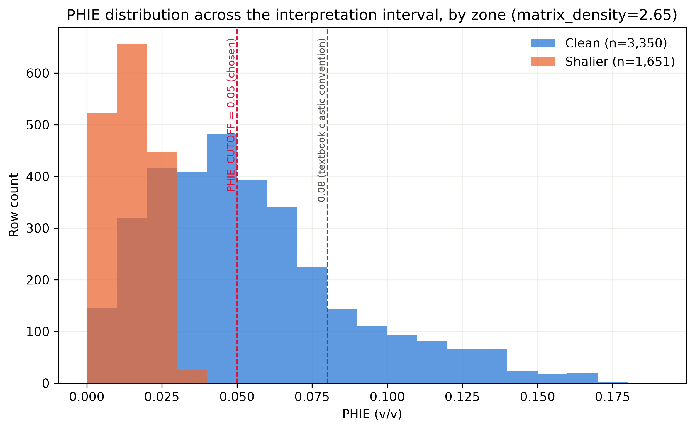
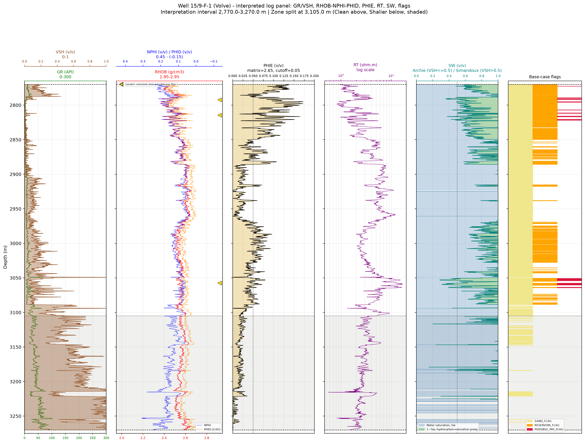
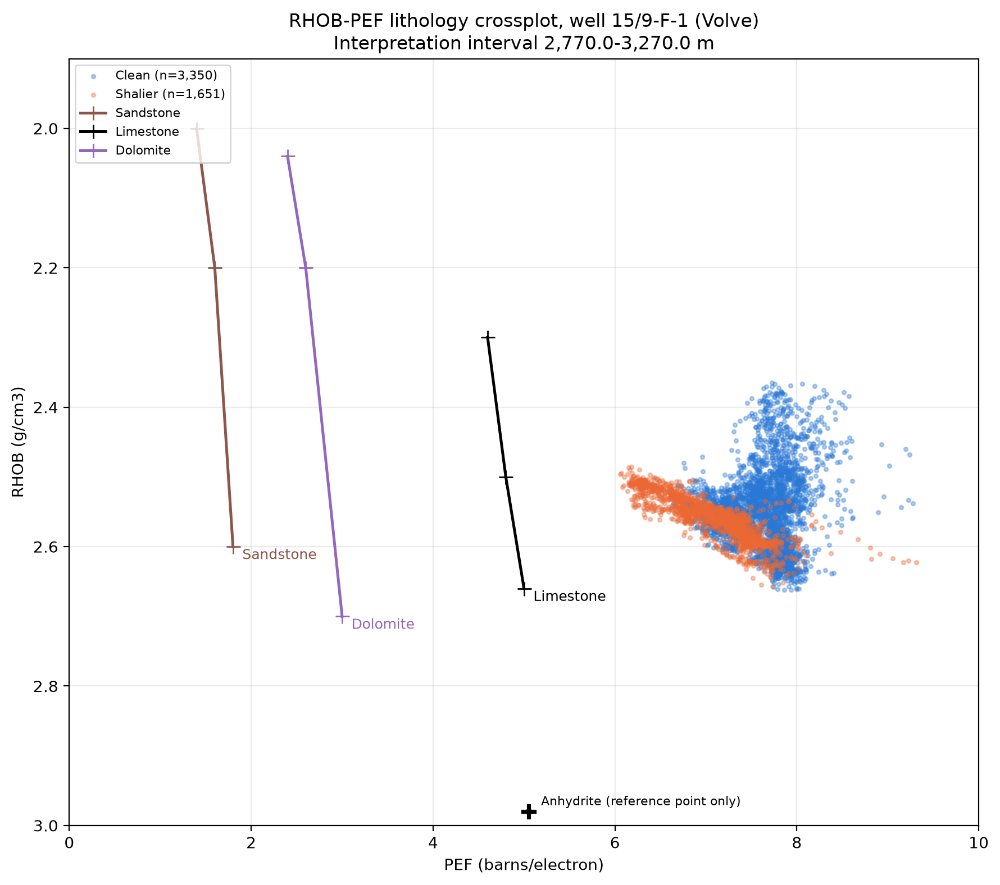
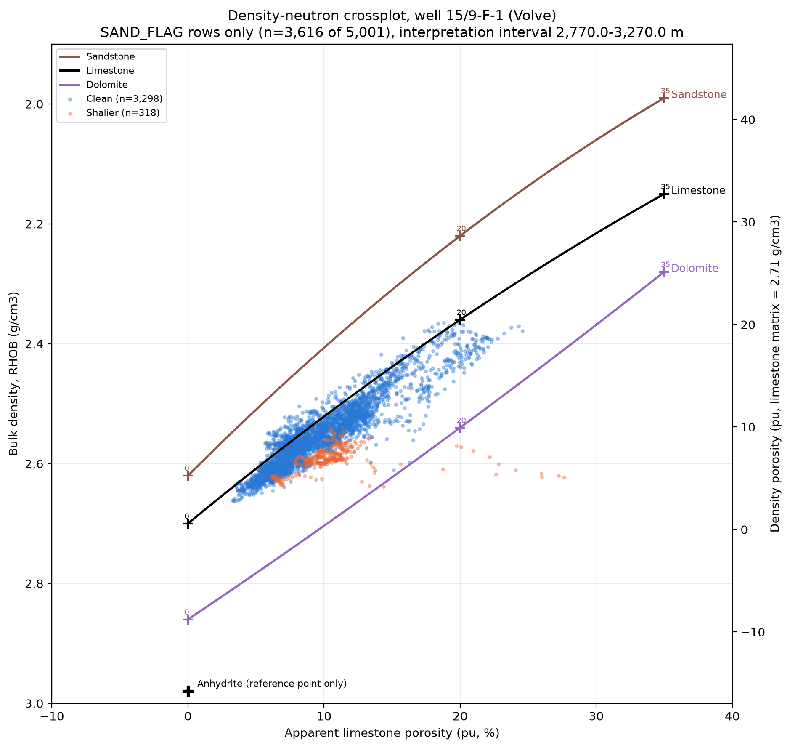

# Automated Well-Log QC and Formation Evaluation in Python

**Volve field | Open North Sea data**

The Volve field produced oil from sandstone of Middle Jurassic age in the Hugin Formation. The reservoir was at a depth of 2700-3100 metres.

A two-notebook Python workflow that takes well-log data from quality control (QC) into screening formation evaluation. 
The automation workflow is built to:
  1. check whether the measurements are reliable. stuck tools or readings, missing numbers, nulls, blanks, depth rows, etc.
  2. calculates the petrophysical parameters. shale volume, porosity and water saturation, identifies possible reservoir and possible pay
  3. show how sensitive the answer is to interpretation assumptions. risk and sensitivity analysis. 

> In petrophysics:
> a correct petrophysical equation can still produce a wrong answer when the input logs are affected by missing data, poor borehole conditions, large density corrections or duplicated measurements
> or the interpretation assumptions are hidden and risks ignored

---

## Why this project matters

This project is a continuity of my MSc thesis titled reservoir-characterization and flow simulation of the Nise Formation at NTNU.
During my MSc thesis , much of this QC was performed manually in IP. 

> The aim here is converting that manual error prone experience into a Python workflow that
> reviews an entire well, keeps every warning attached to the original data, and produces interpretation-ready inputs
> formation evaluation of the well

## How
By answering for example: 
- Are the measurements complete and internally consistent?
- Is the borehole affecting the density response?
- Are two resistivity curves independent, or are they duplicates?
- Which saturation model is suitable for each row?
- Are the constants and cut-offs supported by this well?
- How much does the final answer change when those assumptions change?
---

# Main Results

## Notebook 1 — Well-log QC

| Result | Value |
|---|---:|
| Raw depth rows preserved | 34,861 |
| Curves loaded | 21 |
| Rows containing GR, RHOB, NPHI and RT | 10,018 |
| Rows marked interpretation-ready | 10,007 |
| Main overlapping interval | 2,605.0–3,606.7 m |
| Density rows passing full QC | 10,028 |
| Density rows requiring caution | 11 |
| Strong density-QC concerns | 0 |
| Major CALI–BS mismatch rows | 96 |

No raw measurements were deleted. The results show that the resistivity logs `RT` and `RPCEHM` are exact duplicates. 
Other resistivity curves show near-duplicate responses. This prevented repeated signals from being treated as new logs or mutiple runs.

---

## Notebook 2 — Formation evaluation
 
A **chosen log-defined interval from 2,770.0 to 3,270.0 m**, (5,001 rows) was evaluated.

The interpretation interval was based on the additional log character (GR drop, RT rise, complete RHOB/NPHI coverage) on top the QC
Formal formation tops were not included in the data. 
These intervals are therefore not confirmed Hugin Formation reservoir or any other Formation's interval.

| Base-case result | Value |
|---|---:|
| Interpretation-interval rows | 5,001 |
| Gross interval | 500.0 m |
| Net sand | 361.6 m |
| Net reservoir | 158.0 m |
| Possible net pay | 11.4 m |
| Possible-pay samples | 114 |
| Broad possible-pay clusters | 4 |
| Cleaner-zone mean effective porosity | 5.4% |
| Cleaner-zone mean water saturation | 85.5% |

The 114 possible-pay samples form **three multi-row clusters and one isolated sample**.

Thickness is calculated from qualifying 0.1 m samples. The clusters are not treated as confirmed continuous reservoir beds.

---

## The important finding

The base case identifies **11.4 m of possible net pay**, but the result changes strongly when the assumptions change.

### Cut-off sensitivity

| Scenario | Possible net pay |
|---|---:|
| Conservative | 1.1 m |
| Base | 11.4 m |
| Optimistic | 33.7 m |

### Matrix-density sensitivity

| Matrix density | Possible net pay |
|---|---:|
| 2.65 g/cm³ | 11.4 m |
| 2.68 g/cm³ | 20.2 m |
| 2.71 g/cm³ | 40.9 m |

The cut-off and matrix-density tests were run separately.

The correct conclusion is therefore not 
> “The well contains 11.4 m of pay.”

It is:

> **The selected interval is supported by the QC evidence, but the possible-pay estimate is highly sensitive to matrix density, fluid-property assumptions and interpretation cut-offs.**

For that reason, the result is reported as **possible pay**. 

-------
## Project structure

| Notebook | Purpose | Main output |
|---|---|---|
| [`01_well_log_data_loading_and_qc.ipynb`](01_well_log_data_loading_and_qc.ipynb) | Checks whether the well-log measurements are complete and reliable enough for interpretation. | `results/formation_evaluation_input.csv` |
| [`02_formation_evaluation.ipynb`](02_formation_evaluation.ipynb) | Uses the QC-passed data to calculate reservoir properties and test possible-pay sensitivity. | `results/formation_evaluation_results.csv` |

```text
Raw LAS file
    |
    v
Notebook 1: Data loading and well-log QC
    |
    v
formation_evaluation_input.csv
    |
    v
Notebook 2: Formation evaluation and uncertainty testing
    |
    v
Interpreted logs, interval summaries and sensitivity results
```

---

# Workflow

## 1. Data loading and preservation

- Loads .LAS file and Converts LAS null values to missing values
- Preserves the original measurements and Confirms depth order and sampling interval
- Checks duplicate depths and unexpected depth gaps

## 2. Curve inventory and coverage

- Records mnemonic, unit and description
- Calculates valid depth ranges and find internal missing sections
- Confirms where the main interpretation curves overlap

## 3. Well-log QC

- Flags invalid and unusual values
- Compares caliper with bit size
- Reviews density correction
- Combines `CALI`, `BS`, `DRHO` and `RHOB` into a density-reliability classification
- Uses density–neutron behaviour as a QC diagnostic
- Compares resistivity curves for exact and near duplication
- Creates interpretation-availability and interpretation-readiness flags

## 4. Interval selection

- Reviews log character in depth bins and selects the 2,770.0–3,270.0 m working interval
- Separates a cleaner upper zone from a shalier lower zone and Keeps the interval decision visible and reproducible

## 5. Formation evaluation

- Calculates `IGR` and `VSH`
- Calculates density porosity (PHIT) and shale-corrected effective porosity (PHIE)
- Derives `Rw` from a selected water-bearing calibration interval
- Derives `Rsh` from high-VSH rows
- Applies Archie where `VSH <= 0.50` and Simandoux where `VSH > 0.50`
- Marks all invalid saturation results as `NaN` instead of forcing them to 0 or 1

## 6. Reservoir and possible-pay screening

```text
SAND_FLAG          = VSH <= 0.50

RESERVOIR_FLAG     = SAND_FLAG + PHIE >= 0.05

POSSIBLE_PAY_FLAG  = RESERVOIR_FLAG + SW <= 0.50 + INTERPRETATION_READY_FLAG + SW_MODEL_VALID
```

These are project specific screening assumptions, and can be changed per well or project.

---

# Main Charts and Logs 

## Well-log QC overview


Shows log coverage, borehole condition and density-reliability evidence with depth.

## Density–neutron QC diagnostic


Used as a QC diagnostic only. Passing QC does not prove gas or a specific lithology.

## VSH distribution by zone



Shows the difference in shale-volume response between the cleaner and shalier zones.

## Effective-porosity distribution by zone



Shows the low-porosity character of the interval and supports the use of a project-specific screening threshold.

## Interpreted log panel



Combines the raw logs, derived properties, saturation models, interpretation flags and possible-pay markers.

## Lithology diagnostics





The crossplots do not follow a simple pure-quartz response. They are consistent with a more complex mineral response, including the possibility of calcareous or glauconitic sandstone, but the available logs do not prove one matrix mineralogy.

---

---

# Other Important assumptions

| Item | Working choice | Treatment |
|---|---|---|
| Interpretation interval | 2,770.0–3,270.0 m | Log-defined; not a confirmed formation interval |
| Zone boundary | 3,105.0 m | Based on GR and RT character |
| GR clean reference | 5th percentile | Derived from the selected interval |
| GR shale reference | 95th percentile | Derived from the selected interval |
| VSH model | Linear `VSH = IGR` | Clipped to 0–1 |
| Matrix density | 2.65 g/cm³ | Working baseline; 2.68 and 2.71 tested |
| Fluid density | 1.00 g/cm³ | Not verified from a fluid sample |
| `Rw` | 0.0085 ohm·m | Back-solved from 2,750.0–2,760.0 m assuming `Sw = 1` |
| `Rsh` | 2.244 ohm·m | Median `RT` where `VSH > 0.80` |
| Saturation model | Archie or Simandoux | Selected per row using VSH |
| Base cut-offs | VSH 0.50, PHIE 0.05, SW 0.50 | Tested through sensitivity scenarios |

These are documented interpretation choices for the project. They are not "universal petrophysical constants".

----------------

# Key output files

## QC outputs

| File | Contents |
|---|---|
| `well_log_qc_flagged.csv` | Full loaded well dataset with QC flags retained |
| `formation_evaluation_input.csv` | Rows containing the four required interpretation curves |
| `curve_inventory_and_coverage.csv` | Curve metadata, units, coverage and internal gaps |
| `resistivity_curve_comparison.csv` | Exact and near-duplicate resistivity comparisons |
| `qc_answers_summary.csv` | Summary of the main QC findings |

## Formation-evaluation outputs

| File | Contents |
|---|---|
| `formation_evaluation_results.csv` | Interpreted rows with QC evidence, VSH, porosity, saturation models and screening flags |
| `interval_summary.csv` | Gross and net-thickness results by zone and for the full interval |
| `uncertainty_scenarios.csv` | Cut-off and matrix-density sensitivity results |
| `possible_pay_zones.csv` | Broad possible-pay clusters with VSH, PHIE, SW and RT summaries |

---

# Repository structure

```text
Automated-well-log-qc-formation-evaluation/
├── README.md
├── 01_well_log_data_loading_and_qc.ipynb
├── 02_formation_evaluation.ipynb
├── requirements.txt
├── images/
│   ├── qc_overview_log_panel.png
│   ├── density_neutron_qc_crossplot.png
│   ├── vsh_distribution_by_zone.png
│   ├── phie_distribution_by_zone.png
│   ├── interpreted_log_panel.png
│   ├── rhob_pef_lithology_crossplot.png
│   └── neutron_density_lithology_chart.png
└── results/
    ├── well_log_qc_flagged.csv
    ├── formation_evaluation_input.csv
    ├── curve_inventory_and_coverage.csv
    ├── resistivity_curve_comparison.csv
    ├── qc_answers_summary.csv
    ├── formation_evaluation_results.csv
    ├── interval_summary.csv
    ├── uncertainty_scenarios.csv
    └── possible_pay_zones.csv
```

The raw LAS file is not included in the repository. 
Download the Volve dataset from Equinor’s official open-data page: https://www.equinor.com/energy/volve-data-sharing

---

# Scope and limitations

This is a personal formation evaluation workflow using Equinor's open Volve field. 
Limitations include:

- Formal formation tops not integrated
- The selected interval and zone boundary are based on log character
- Core measurements, XRD and mineral-density calibration were not available
- Pressure data and confirmed fluid contacts were not integrated
- No production test was used to confirm fluid type
- Complete mud invasion and environmental-correction information was not available
- `Rw`, `Rsh`, matrix density and cut-offs remain assumptions
- The effects of all uncertain parameters were not combined into one probabilistic model
- QC and interpretation flags indicate confidence and review priority; they do not prove lithology, fluid type or commercial pay.

---

# AI-assisted development and technical ownership

I used generative AI to support parts of the Python implementation, debugging, documentation and code review.

I remained responsible for the technical workflow:

- defined the petrophysical questions
- selected and documented the assumptions
- reviewed and tested the generated code
- checked results against the original logs and geological behaviour
- corrected invalid saturation handling and inconsistent sensitivity logic
- re-ran the notebooks after each corrections
- decided what each QC and interpretation flag meant

The petrophysical judgement, validation and final technical decisions remained mine.
AI accelerated implementation.

---

# Data and attribution

This project uses well-log data from Equinor’s open Volve field dataset.

- **Data owner/source:** Equinor and the Volve licence partners
- **Use:** Subject to the Equinor Open Data Licence

Review Equinor’s current terms before downloading, using or redistributing the source data.

---

**Related repository:**  
[Nise Formation Reservoir Characterization and Flow Simulation](https://github.com/lindahafrifa-code/Nise-Formation-Reservoir-Characterization-and-Flow-Simulation)

---

# References

- Asquith, G. B. & Gibson, C. R. (1982). *Basic Well Log Analysis for Geologists.*
- American Association of Petroleum Geologists. https://doi.org/10.1306/Mth3425
- Simandoux, P. (1963). Shaly-sand water-saturation model.
- Winsauer, W. O. et al. (1952). Humble parameters used in the Archie calculation.
- Norwegian Offshore Directorate formation descriptions used as regional geological context.

---

**Author:** Linda Afrifa  
Petroleum Geoscientist | Petrophysics | Python | Subsurface Data |  [LinkedIn](https://www.linkedin.com/in/linda-afrifa)


