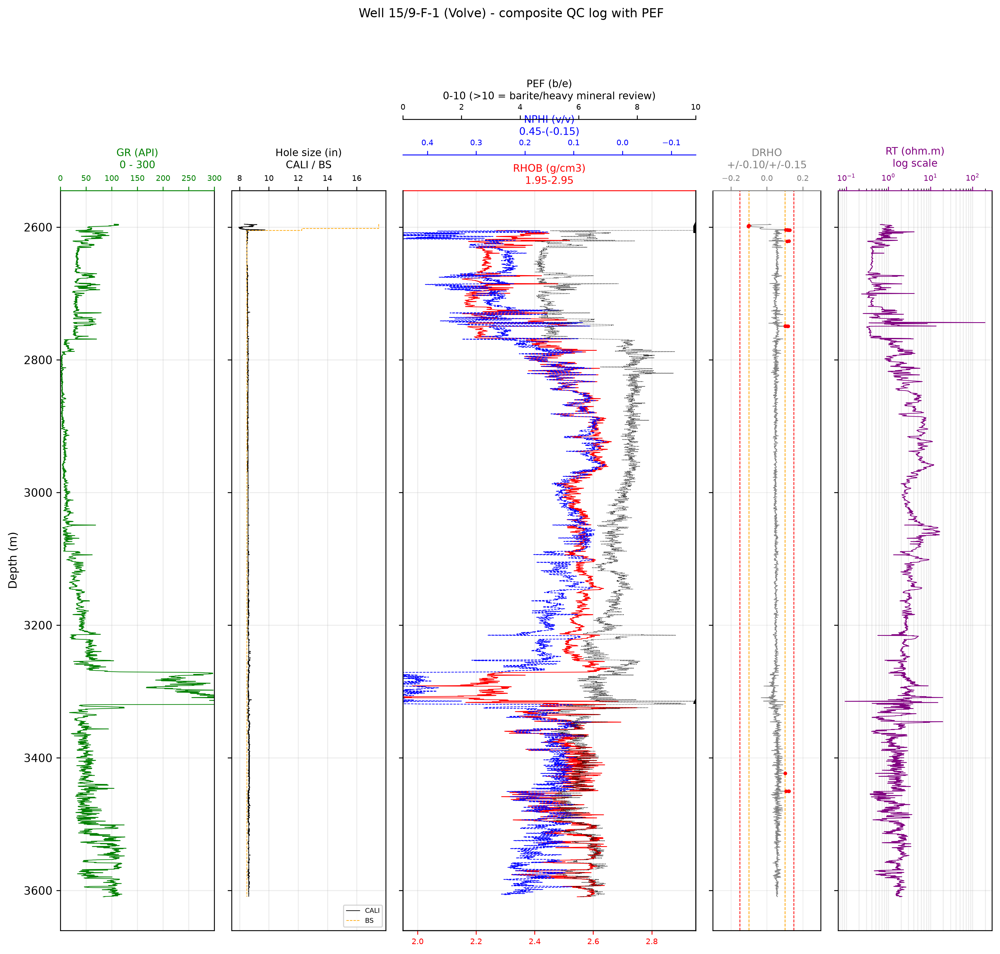
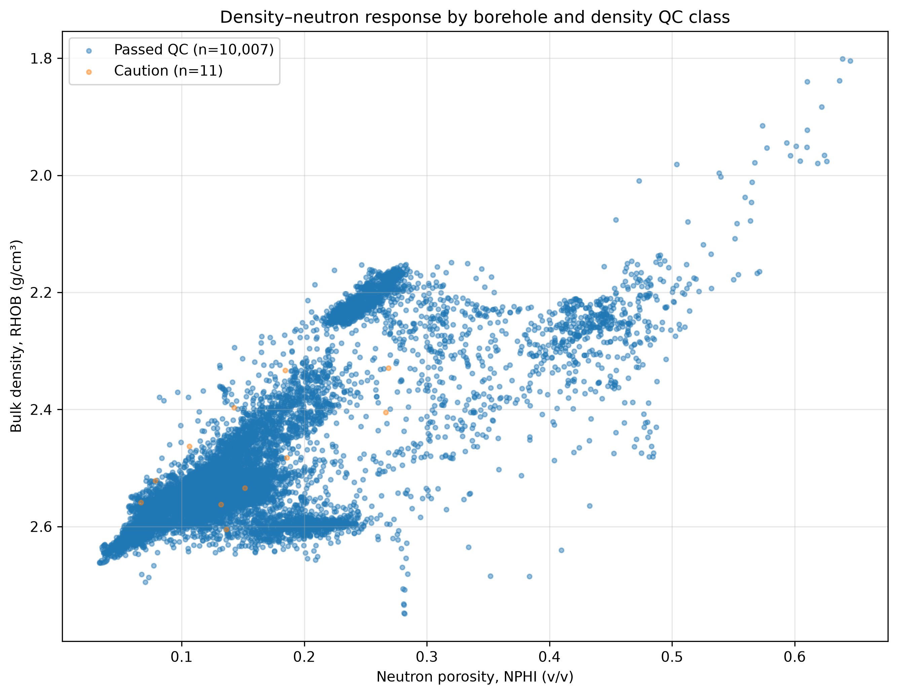

# Automated Well-Log QC in Python

**Volve field, well 15/9-F-1 | Open North Sea data**

A reproducible Python workflow that checks whether well-log measurements are reliable enough for petrophysical interpretation before calculating porosity, water saturation, reservoir quality or pay.

## Why this project matters

A correct petrophysical equation can still produce a wrong answer when the input logs are affected by missing data, poor borehole conditions, large density corrections or duplicated measurements.

During my MSc thesis (reservoir-characterization and flow simulation of the Nise Formation) at NTNU, much of this QC was performed manually in Interactive Petrophysics. 
This project converts that experience into a Python workflow that reviews an entire well, keeps every warning attached to the original data,
and produces interpretation-ready inputs for the next stage.

## Key results

| Result | Value |
|---|---:|
| Raw depth rows preserved | 34,861 |
| Curves loaded | 21 |
| Rows containing GR, RHOB, NPHI and RT | 10,018 |
| Rows marked interpretation-ready | 10,007 |
| Interpretation-ready interval | 2,605.0 - 3,606.7 m |
| Density rows passing full QC | 10,028 |
| Density rows requiring caution | 11 |
| Strong density-QC concerns | 0 |
| Major CALI–BS mismatch rows | 96 |

No raw measurements were deleted. 
Rows outside the interpretation-ready set remain in the QC output with their original values and review flags.


## What the workflow checks

- **Well and depth integrity:** confirms the well information, depth order, sampling interval, duplicate depths and unexpected depth gaps.
- **Curve inventory and coverage:** records each mnemonic, unit, valid depth range and missing gaps inside the logged interval.
- **Numerical screening:** separates hard validity problems (e.g negative or zero resistivity, missing/duplicate depth, missing-value i.e -999.25) from unusual values (very high gamma ray or resistivity) that require review.
- **Borehole condition:** compares caliper (`CALI`) with nominal bit size (`BS`) to identify approximately on-gauge, enlarged, under-gauge and major mismatch intervals.
- **Density reliability:** combines borehole condition, bulk-density correction (`DRHO`) and `RHOB` screening.
- **Density–neutron consistency:** separates passed-QC points from measurements affected by borehole or density concerns before any gas or lithology interpretation.
- **Resistivity duplication:** identifies exact and near-duplicate resistivity curves so repeated signals are not treated as independent evidence.
- **Interpretation readiness:** marks rows suitable for later shale-volume, porosity and saturation calculations.

  
## QC visuals

### Main log and density-reliability panel



This panel shows where QC concerns occur with depth and whether CALI, BS, RHOB, DRHO, NPHI, GR and RT respond together.

### Density–neutron QC diagnostic



The crossplot is used as a QC diagnostic only. A point that passes QC remains a geological or fluid candidate; it is not automatically interpreted as gas.

## Important technical decisions

The thresholds in this notebook are **documented screening assumptions**, not universal geological cut-offs. They create review flags and do not automatically remove data.

| Check | Screening logic |
|---|---|
| Approximately on gauge | `abs(CALI - BS) <= 0.50 in` |
| Major CALI–BS mismatch | more than 2.00 inches below nominal bit size |
| DRHO caution | `abs(DRHO) > 0.10 g/cm³` |
| Strong DRHO concern | `abs(DRHO) > 0.15 g/cm³` |
| Main resistivity input | `RT`, after duplicate-curve comparison |

The 0.50-inch borehole tolerance is an analyst-selected first-pass screening band.
The 96 major CALI–BS mismatches occur near a hole-section transition and are carried forward as review flags and not labelled automatically as mudcake or washouts.

## Main finding

The QC workflow found that the main overlapping petrophysical interval, with the important logs for interpretation, is generally reliable:

- 10,018 rows contain the four required interpretation curves.
- 10,007 of those rows pass the current interpretation-readiness screen.
- Only 11 density samples require caution.
- `RT` and `RPCEHM` are exact duplicates; additional resistivity curves are also near-duplicates or effectively the same response.

This prevents duplicated curves and borehole-affected measurements from silently influencing the later formation evaluation.

## Repository contents

```text
automated-well-log-qc-formation-evaluation/
├── README.md
├── 01_well_log_data_loading_and_qc.ipynb
├── images/
│   ├── qc_overview_log_panel.png
│   └── density_neutron_qc_crossplot.png
├── results/
│   ├── well_log_qc_flagged.csv
│   ├── formation_evaluation_input.csv
│   ├── curve_inventory_and_coverage.csv
│   └── qc_answers_summary.csv
└── requirements.txt
```

## How to run

1. Install the required packages:

```bash
pip install lasio pandas numpy matplotlib
```
2. Place the Volve LAS input file in the location specified in the notebook.
3. Open `01_well_log_data_loading_and_qc.ipynb`.
4. Run all cells from top to bottom.

## Data

This project uses well-log data from Equinor's open Volve field dataset.

Well: 15/9-F-1  
Input file: WLC_PETRO_COMPUTED_INPUT_1.LAS

Follow Equinor's data terms and attribution requirements when downloading, using or redistributing the source data.

The raw LAS file is not redistributed in this repository. Download the Volve dataset from Equinor's official data-sharing page and place the LAS
file inside:

/WLC_PETRO_COMPUTED_INPUT_1.LAS

Use of the source data remains subject to the Equinor Open Data Licence.

## Connection to my MSc work

My MSc thesis at NTNU integrated petrophysical interpretation, core description, seismic data, geological modelling and reservoir simulation for the Nise Formation on the Norwegian Continental Shelf.

The thesis interpretation was completed primarily in Interactive Petrophysics. 
This portfolio project rebuilds the QC stage in Python using Volve data, making the checks reproducible, auditable and reusable.

**Related project:**  
[MSc Thesis Repository — Nise Formation Reservoir Characterization]((https://github.com/lindahafrifa-code/Nise-Formation-Reservoir-Characterization-and-Flow-Simulation))

## Scope and limitations

- This repository currently covers **data loading and well-log QC**.
- Formation evaluation is the next notebook and will calculate shale volume, porosity, water saturation, net reservoir and possible pay.
- The LAS file was a composite dataset with limited information on exact tool models, mud system and environmental-correction history.
- QC flags indicate confidence and review priority; they do not prove lithology, fluid type or commercial pay.
